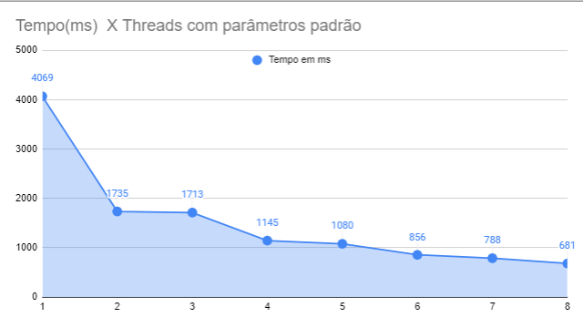
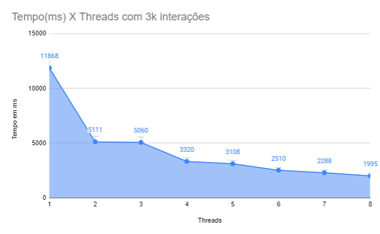

# Mandelbrot

## Configurações do processador:
12th Gen Intel(R) Core(TM) i5-12500H 3.10 GHz - 12 núcleos

## Mudanças realizadas no código:
- Mudança simples do código main para facilitar a geração de uma média do tempo de execução gasto para gerar uma imagem, tanto para single como para multi-thread.

## Resultados obtidos:
### Executando sem alterar os parâmetros:
#### Resultados:
| Threads | Tempo em ms | Ganho em relação ao singlethread |
|---------|-------------|--------------|
| 1       | 4069        | 0            |
| 2       | 1735        | 2.345244957  |
| 3       | 1713        | 2.375364857  |
| 4       | 1145        | 3.55371179   |
| 5       | 1080        | 3.767592593  |
| 6       | 856         | 4.753504673  |
| 7       | 788         | 5.163705584  |
| 8       | 681         | 5.975036711  |
#### Gráfico:

### Executando alterando interações para 3k:
#### Resultados:
| Threads | Tempo em ms | Ganho        |
|---------|-------------|--------------|
| 1       | 11868       | 0            |
| 2       | 5111        | 2.322050479  |
| 3       | 5060        | 2.345454545  |
| 4       | 3320        | 3.574698795  |
| 5       | 3108        | 3.818532819  |
| 6       | 2510        | 4.728286853  |
| 7       | 2288        | 5.187062937  |
| 8       | 1995        | 5.94887218   |

#### Gráfico:
